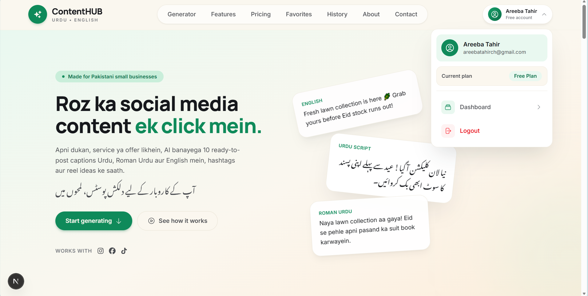
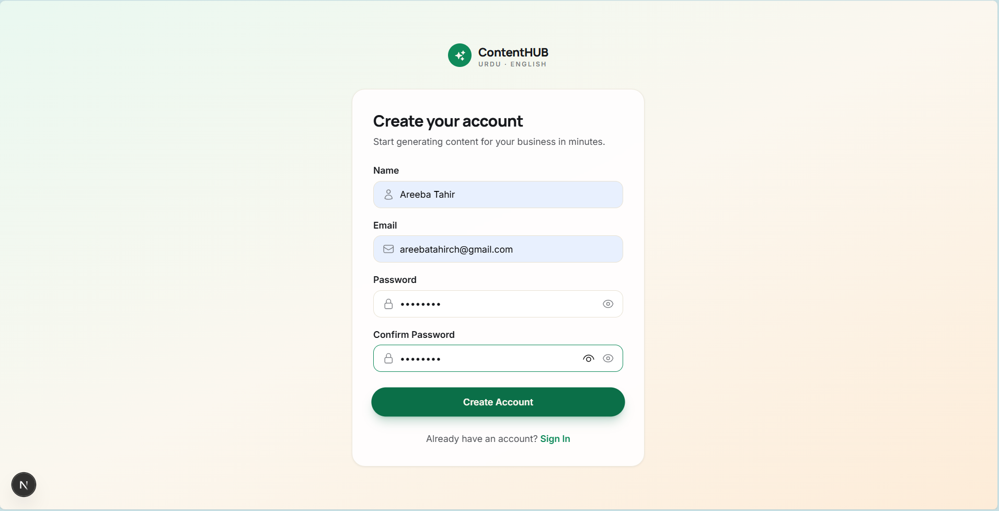
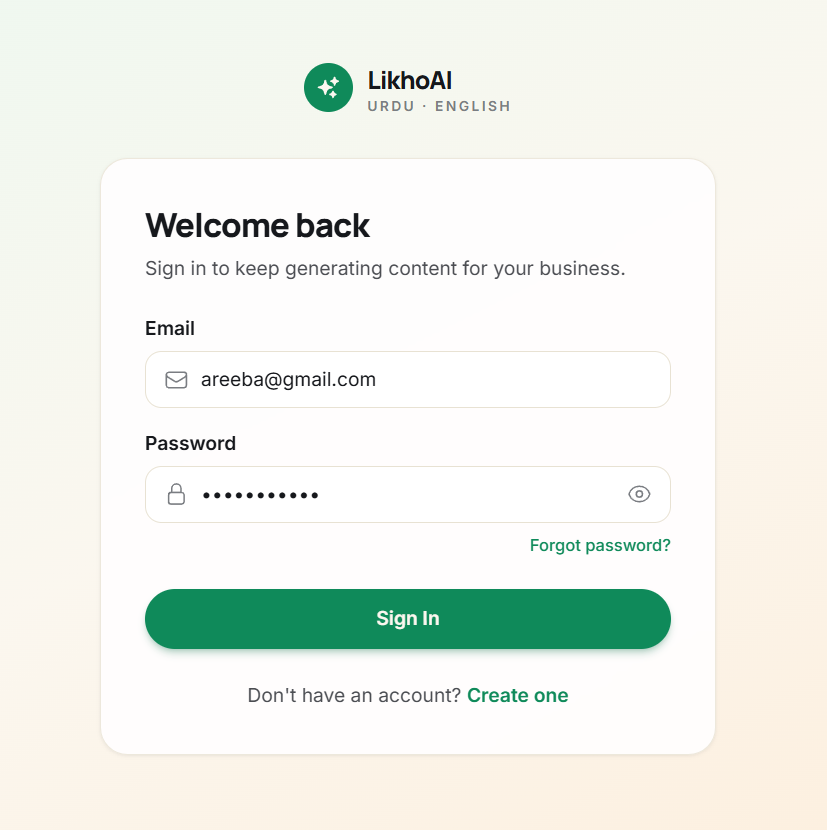
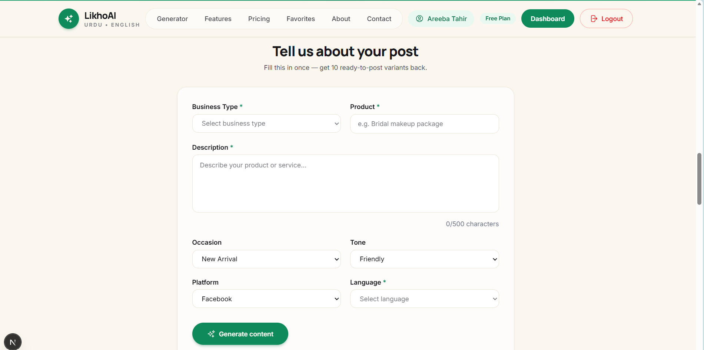
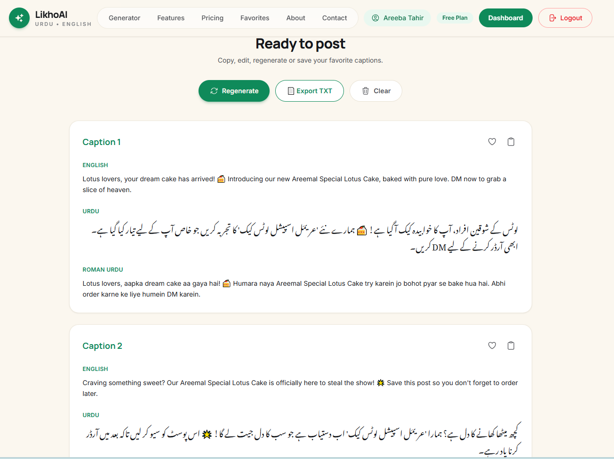
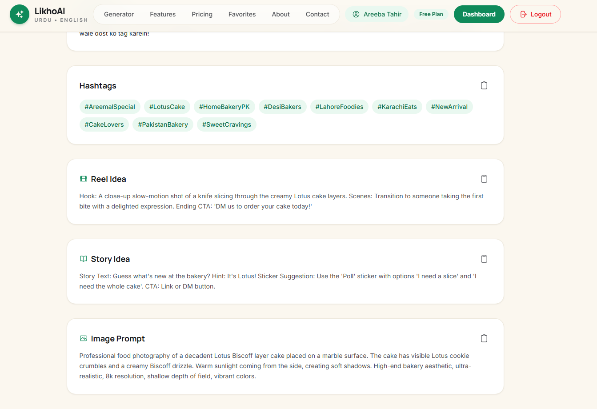
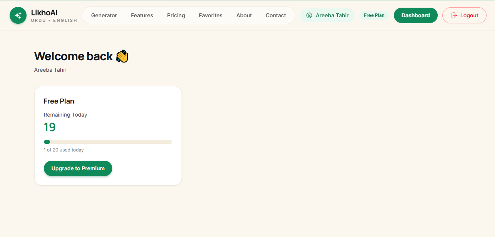

# 🚀 LikhoAI – AI Social Media Caption Generator

LikhoAI is an AI-powered web application that helps small businesses, creators, and entrepreneurs generate engaging social media content in **English, Urdu, and Roman Urdu**.

Users can create multiple caption variations, hashtags, reel ideas, story ideas, and image prompts within seconds using AI.

---

## ✨ Features

- 🤖 AI-generated captions
- 🇵🇰 English, Urdu & Roman Urdu support
- ❤️ Save favorite captions
- 🕒 View generation history
- 📄 Export captions as TXT
- 🔄 Regenerate content
- 🔐 Firebase Authentication
- ☁️ Firestore Database
- 📱 Responsive UI

---

## 🛠 Tech Stack

- Next.js 15
- React
- TypeScript
- Tailwind CSS
- Firebase Authentication
- Cloud Firestore
- Gemini AI API

---

## 📂 Project Structure

```
app/
components/
lib/
public/
```

---

## ⚙️ Installation

Clone the repository

```bash
git clone <repository-url>
```

Move into the project

```bash
cd likhoai
```

Install dependencies

```bash
npm install
```

Create a `.env.local` file and add your Firebase and Gemini API keys.

Run the development server

```bash
npm run dev
```

Open

```
http://localhost:3000
```

---

## 🔑 Environment Variables

Create a `.env.local` file.

Example:

```env
NEXT_PUBLIC_FIREBASE_API_KEY=
NEXT_PUBLIC_FIREBASE_AUTH_DOMAIN=
NEXT_PUBLIC_FIREBASE_PROJECT_ID=
NEXT_PUBLIC_FIREBASE_STORAGE_BUCKET=
NEXT_PUBLIC_FIREBASE_MESSAGING_SENDER_ID=
NEXT_PUBLIC_FIREBASE_APP_ID=

GEMINI_API_KEY=
```

---

## 📸 Screenshots

Add screenshots of:

### Home Page



### Sign Up



### Sign In



### Generator Page



### Generated Captions





### Dashboard




---

## 🎯 Future Improvements

- Premium Plans
- PDF Export
- Image Generation
- Multi-language Support
- AI Tone Personalization
- Analytics Dashboard

---

## 👩‍💻 Developed By

**Areeba Tahir**

BS Information Technology  
Quaid-i-Azam University Islamabad

GitHub: https://github.com/areeba-tahir2005

LinkedIn: https://www.linkedin.com/in/areeba-tahir2005/

---

## 📄 License

This project is developed for educational and portfolio purposes.
